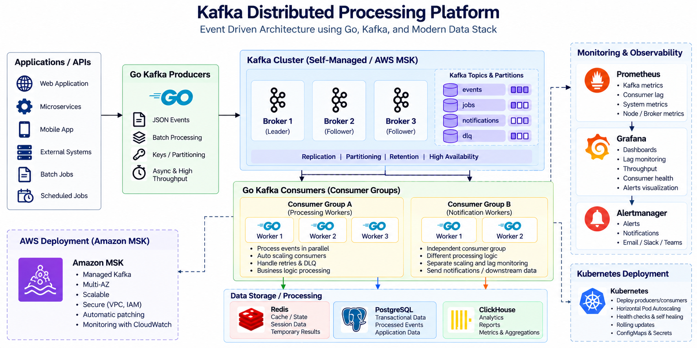

# Kafka Distributed Processing Platform

A production-style Kafka distributed processing platform built around **Go**, Kafka, Kubernetes, Prometheus, Grafana, Redis, PostgreSQL, ClickHouse, and AWS MSK architecture.

## Architecture



## Flow

```text
Applications / APIs
        |
        v
Go Kafka Producers
        |
        v
Kafka Cluster
  |       |       |
events   jobs   notifications
  |       |       |
  +-------+-------+
          |
          v
Go Consumer Groups
   |             |
   v             v
Processing     Notification
Workers        Workers
   |             |
   +------+------+
          |
          v
 Redis / PostgreSQL / ClickHouse
```

## Core Focus

- Kafka producers and consumers using Go
- Topics and partitions
- Consumer groups
- Partition-based parallelism
- Consumer scaling and rebalancing
- Consumer lag
- Message retention
- Retry and dead-letter topics
- High-throughput event processing
- Prometheus/Grafana observability
- Kubernetes deployment patterns
- AWS MSK reference architecture

## Project Status

This repository is a portfolio implementation/reference project. The local Go producer and consumer are provided for hands-on Kafka testing. The AWS MSK section is an architecture/configuration reference and does not claim an already-deployed AWS environment.

## Repository Structure

```text
architecture/
├── architecture.png
└── architecture.md

producer/
├── README.md
└── main.go

consumer/
├── README.md
└── main.go

kafka/
├── topics.md
├── partitions.md
├── consumer-groups.md
├── retention.md
├── scaling.md
└── retry-dlq.md

monitoring/
├── prometheus.md
├── grafana.md
└── consumer-lag.md

docker/
└── docker-compose.yml

kubernetes/
├── deployment.yaml
└── service.yaml

aws/
└── msk-architecture.md

docs/
└── interview-guide.md

go.mod
```

## Technology Stack

Go, Apache Kafka, Docker, Kubernetes, Prometheus, Grafana, AWS MSK, Redis, PostgreSQL, ClickHouse.

## Why Go?

Go is used for the producer and consumer services to demonstrate lightweight, concurrent, high-throughput event-processing services suitable for cloud-native and distributed workloads.
